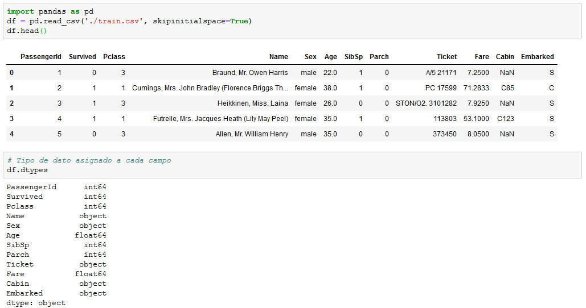
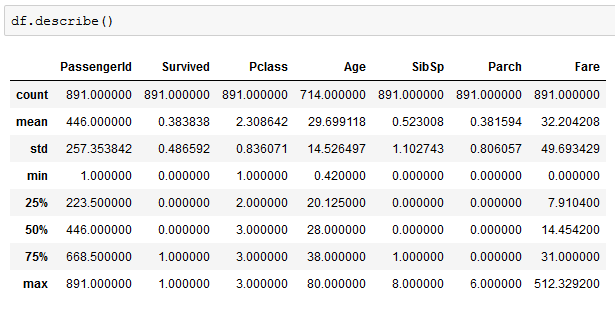
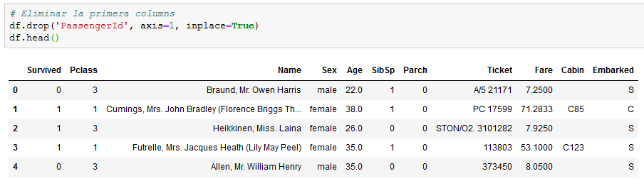
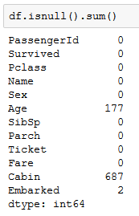
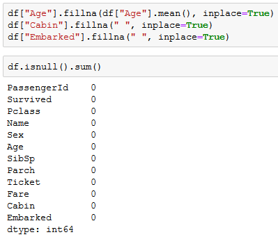
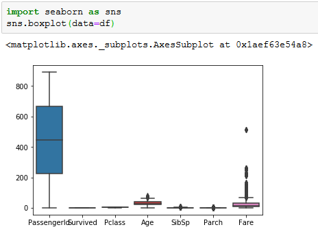
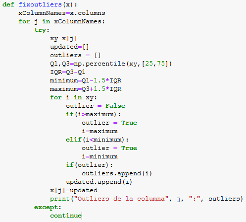
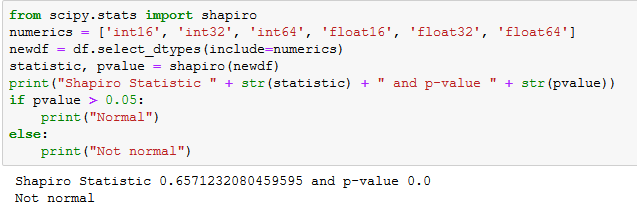
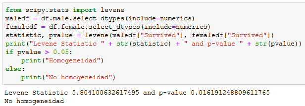

# PRÁCTICA 2 - LIMPIEZA Y VALIDACIÓN DE LOS DATOS

## DESCRIPCIÓN DEL DATASET

El conjunto de datos seleccionado para el análisis se ha conseguido en [Kaggle](https://www.kaggle.com/c/titanic). El dataset obtenido contiene registros sobre los pasajeros que abordaron el transatlántico Titanic el 10 de abril de 1912 desde el puerto Southampton y los pasajeros que se incorporaron en los puertos de Cherburgo, Francia, y en Queenstown en Irlanda.

Este conjunto de datos de entrenamiento está compuesto por 12 atributos que representan 891 pasajeros que navegaban en el titanic.

Los campos de este conjunto de datos son los siguientes:

- PassengerId
- Survived: indica si el pasajero ha sobrevivido o no.
- Pclass: clase en la que viajaba el pasajero.
- Name: nombre del pasajero.
- Sex: sexo del pasajero.
- Age: edad del pasajero.
- SibSp: número de hermano/conyuge a bordo.
- Parch: número de padres/hijos a bordo.
- Ticket: tipo de ticket del pasajero.
- Fare: tarifa correspondiente al ticker del pasajero.
- Cabin: la cabina donde se hospeda el pasajero.
- Embarked: el puerto donde los pasajeros han embarcado.

### Importancia y objetivos de los análisis

Con este conjunto de datos se plantea la problemática de determinar qué variables influyen más a la hora de determinar la probabilidad de supervivencia de un pasajero en el Titanic. Para esto, se crearán modelos de regresión que permitan predecir la probabilidad de supervivencia de un pasajero en función de sus características,así como contrastes de hipótesis que ayuden a identificar propiedades interesantes en las muestras que puedan ser inferidas con respecto a la población.

Estos análisis adquieren una gran relevancia en casi cualquier sector relacionado con la navegación. Un ejemplo de ello sería el de determinar el precio de el seguro de un pasajero en función de sus características. También se pueden generar modelos que ayuden a distribuir a los pasajeros por las distintas secciones del barco en función de sus características con el fín de conseguir salvar el máximo de pasajeros posibles en caso de emergencia.

## INTEGRACIÓN Y SELECCIÓN DE LOS DATOS DE INTERÉS A ANALIZAR

Antes de comenzar con la limpieza de los datos, procedemos a realizar la lectura del fichero en formato CSV en el que se encuentran. El resultado devuelto por la llamada a la función read.csv() será un objeto data.frame:

Además, observamos cómo los tipos de datos asignados automáticamente por Python a las variablesse corresponden con el dominio de estas.

A la hora de realizar la selección de atributos, lo primero a tener en cuenta es que en principio se pueden eliminar las características que no son propiamente del pasajero, como valores asignados. Por lo tanto, podemos prescindir del primer campo (`PassengerId`) dado que no son atributos propios de los pasajeros y, por tanto no resulta relevante a la hora de resolver nuestro problema, y el nombre, ya que este tampoco es relevante.

Aunque la variable ('Cabin') podría haberse tenido en cuenta, prescindiremos de ella por dos motivos:

- No sabemos en que zona del barco se encontraba el pasajero en el momento de la tragedia.
- La variable contiene un alto porcentaje de valores perdidos.

Una vez eliminados estos atributos, vamos a realizar un primer análisis visual para determinar que variables pueden ser potencialmente más determinantes a la hora de generar los modelos. Observaremos distintos diagramas de barras para determinar que valores de los distintos atributos están relacionados con mayores probabilidades de sobrevivir.

Observando los diagramas de barras creados llegamos a las siguientes conclusiones:

- Los pasajeros tienen una probabilidad de supervivencia proporcional a la clase en la que viajan, siendo los de primera clase los que tienen más probabilidad de sobrevivir y los de tercera clase los que menos.
- Las mujeres tienen mayor probabilidad de sobrevivir que los hombres.
- Los niños, y en especial los de teprana edad (entre 0 y 5 años) tienen mayor probabilidad de sobrevivir.
- Las personas con familiares a bordo tienen mayor probabilidad de sobrevivir que los que viajan sin familiares.
- El tratamiento que reciben en la variable ('Name') tiene gran influencia a la hora de determinar la probabilidad de supervivencia. Creamos una nueva variable ('Title') donde almacenaremos estos tratamientos.

## LIMPIEZA DE LOS DATOS

### ¿Los datos contienen ceros o elementos vacíos?

### ¿Cómo gestionarías cada uno de estos casos?

Existen diferentes maneras de gestionar los elementos vacíos:

- Reemplazar el elemento vacío por un valor (constante, media, mediana...).
- Eliminar las filas con elementos vacíos.

En nuestro caso, reemplazaremos el elemento vacío por un valor:

- Para el atributo `Age`, reemplazaremos los elementos vacíos por la utilizando una imputación por el algoritmo KNN.
- Para el atributo `Embarked`, reemplazaremos los valores vacíos por el valor "S", ya que es el que tiene mayor porcentaje de aparición y hay pocos valores nulos (2).
- Prescindimos de la variable ('Cabin') ya que no será utilizada en los análisis.

### Identificación y tratamiento de valores extremos

Los valores extremos o outliers son aquellos que parecen no ser coherentes si realizamos una comparación con el resto de los datos. Para identificarlos, podemos hacer uso de dos vías:

- Representar un diagrama de caja por cada variable y ver qué valores distan mucho del rango intercuartílico (la caja).
- Utilizar la función boxplots.stats() de R, la cual se emplea a continuación.

Así, se mostrarán sólo los valores atípicos para aquellas variables que los contienen:

Como podemos observar en el gráfico anterior, se detectan valores atípicos en los atributos `Age`, `SibSp`, `Parch` y `Fare`.

Trataremos estos valores atípicos en función de los valores intercuartílicos 1 y 3, y cogeríamos el valor máximo y mínimo dentro de ese rango. Si el valor supera el valor máximo, este valor se cambiara por este, de igual manera con el mínimo.

Función para eliminar valores atítipicos:

## ANÁLISIS DE LOS DATOS

### Selección de los grupos de datos que se quieren analizar/comparar (planificación de los análisis a aplicar).

A continuación, se seleccionan los grupos dentro de nuestro conjunto de datos que pueden resultar interesantes para analizar y/o comparar.

De acuerdo con las conclusiones obtenidas en el apartado de integración y selección de los datos de interés a analizar, generaremos modelos utilizando las siguientes variables: "Age", "Sex", "Title" (creada a partir de los tratamientos contenidos en "Name"), "Parch", "SibSp" y "Pclass". AUnque parece tener menos influencia que el resto de variables mencionadas, también incluiremos la variable "Embarked".

### Comprobación de la normalidad y homogeneidad de la varianza

***Normalidad***

Para realizar la comprobación de que los valores que toman nuestras variables cuantitativas provienen de una población distribuida normalmente, utilizaremos la prueba de normalidad de Shapiro-Wilk.
Así, se comprueba que para que cada prueba se obtiene un p-valor superior al nivel de significación prefijado alfa = 0, 05. Si esto se cumple, entonces se considera que variable en cuestión sigue una distribución normal.

Para el caso que nos atribuye comprobamos que no podemos asumir normalidad en los análisis y modelos a generar.

Podemos observar que los p-values son menores que 0,05, lo que indica que no hay una distribución normal de las variables analizadas..

***Homogeneidad***

Continuamos estudiando la homogeneidad de varianzas mediante la aplicación de un test de Levene (Fligner-Killeen). En este caso, estudiaremos esta homogeneidad en cuanto a los grupos conformados por los pasajeros supervivientes y los no supervivientes. En el siguiente test, la hipótesis nula consiste en que ambas varianzas son iguales.

Podemos observar que el valor p es menor que 0,05, lo que indica que hay una diferencia significativa en las variaciones entre los grupos.

### Aplicación de pruebas estadísticas para comparar los grupos de datos. En función de los datos y el objetivo del estudio, aplicar pruebas de contraste de hipótesis, correlaciones, regresiones, etc. Aplicar al menos tres métodos de análisis diferentes

El primer paso que realizamos es comprobar la correlación entre la variable Survived y el resto de variables. Comprobamos como la variable más correlacionada es "Sex", seguida de "Pclass".

A continuación comprobamos que existen diferencias significativas en la probabilidad de sobrevivir en función del sexo. Aplicamos un t-test estableciendo como hipótesis nula (H0) que no existen diferencias significativas entre las probabilidades de supervivencia en función del sexo y como hipótesis alternativa (H1) que sí existen diferencias significativas y por lo tanto la media de la variable supervivencia para los dos sexos es distinta.

Observando los resultados obtenidos vemos como se obtiene un p-value muy inferior a 0,05, lo que nos indica que no podemos aceptar la hipótesis nula y debemos quedarnos con la alternativa. Aplicamos el test de Wilcoxon para asegurar los resultados al tratarse de una población de la cual no podemos asumir la condición de normalidad. Una vez más obtenemos un p-value muy por debajo de 0,05. Cabe comentar que para realizar los tests escogemos muestras de datos por encima de los 30 registros de tamaño para poder trabajar asumiendo que trabajamos con muestras de gran tamaño.

Una vez realizados los tests estadísticos anteriores, procedemos a generar un modelo de regresión logística. Antes del entrenamiento necesitamos aplicar una serie de preprocesados a los datos para dejarlos listos para el análisis.

El primer paso es aplicar una normalización a los valores de las variables "Age" y "Fare". Aplicamos un StandardScaler() con el que dejamos todos los valores dentro del rango [-1,1] y las variables pasan a tener media 0 y desviación 1.

Acto seguido, creamos nuevas variables binarias a partir de los valores de las variables "Title", "Pclass", "Embarked", "SibSp", "Parch" y "Sex". Utilizamos el comando get_dummies de la librería Pandas.

Una vez tenemos los datos listos, dividimos el conjunto en train y test, dejando un 20% de los datos para testear.

Finalmente generamos el modelo de regresión logística con los datos de train y comprobamos sus prestaciones tanto para el conjunto de train como para el de test. Vemos que obtenemos una precisión de predicción de la variable "Survived" superior al 80% y los resultados obtenidos para train y test no varían en exceso, por lo que podemos considerar que los resultados son buenos y el modelo ofrece buenas prestaciones.

Encontramos el código en el script MAIN.py

## Representación de los resultados a partir de tablas y gráficas

## Resolución del problema. A partir de los resultados obtenidos, ¿cuáles son las conclusiones? ¿Los resultados permiten responder al problema?

## CONTRIBUCIONES AL TRABAJO

| Contribuciones  | Firma  |
|---|---|
| Investigación previa  | PFA, MAC |
| Redacción de las respuestas  | PFA, MAC |
| Desarrollo código | PFA, MAC |
